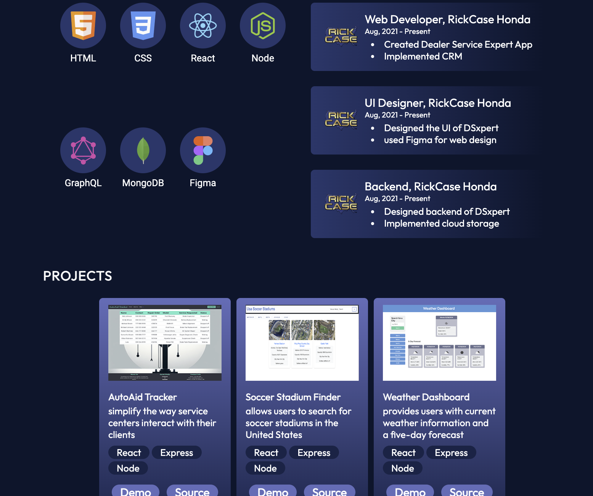

# React Portfolio

## Description

The React Portfolio project is a modern, responsive portfolio website built with React. It showcases personal projects, work experience, and contact information. This project was developed to provide a professional online presence and demonstrate skills in web development using React.

- **Motivation:** To create a professional online portfolio to showcase my web development skills.
- **Why:** A personal portfolio is essential for demonstrating capabilities to potential employers and clients.
- **Problem:** Existing portfolio templates did not offer the flexibility and modern design I desired.
- **Learnings:** Enhanced skills in React, React Router, and responsive web design. Gained experience in deploying React applications.

## Table of Contents

- [Installation](#installation)
- [Usage](#usage)
- [Credits](#credits)
- [License](#license)

## Installation

Follow these steps to install and set up the project:

1. Clone the repository:
    ```bash
    git clone https://github.com/andersonasprilla/react-portfolio.git
    ```
2. Navigate to the project directory:
    ```bash
    cd react-portfolio
    ```
3. Install dependencies:
    ```bash
    npm install
    ```
4. Start the development server:
    ```bash
    npm start
    ```

## Usage

To use the application, follow these steps:

1. Open your browser and navigate to `http://localhost:3000`.
2. Navigate through the different sections of the portfolio using the navigation bar:
    - **Home:** Introduction and professional summary.
    - **About:** Detailed information about my background and skills.
    - **Experience:** Overview of my work experience and roles.
    - **Projects:** Showcase of my personal and professional projects.
    - **Contact:** Contact form and information for reaching out to me.

### Screenshots




## Credits

- **Developer:** [Your Name](https://github.com/andersonasprilla)
- **Third-party assets:** 
    - Icons by [FontAwesome](https://fontawesome.com/)
    - Images from [Unsplash](https://unsplash.com/)

## License

This project is licensed under the MIT License - see the [LICENSE](LICENSE) file for details.

---

## Features

- Responsive design for various devices
- Smooth scrolling and dynamic routing
- Interactive project showcase
- Contact form with validation

## How to Contribute

To contribute to this project, follow these steps:

1. Fork this repository.
2. Create a new branch:
    ```bash
    git checkout -b feature/your-feature-name
    ```
3. Make your changes and commit them:
    ```bash
    git commit -m 'Add some feature'
    ```
4. Push to the branch:
    ```bash
    git push origin feature/your-feature-name
    ```
5. Create a pull request.

## Tests

To run tests, use the following command:

```bash
npm test
